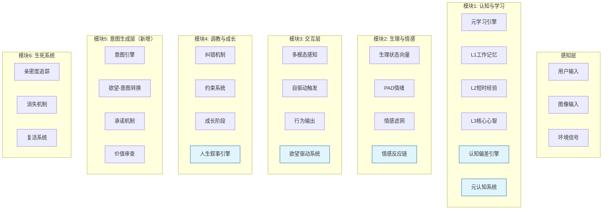
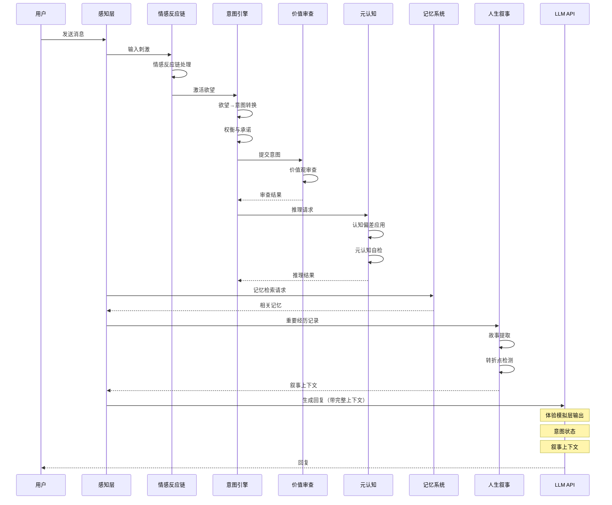

# AKIHO 架构设计文档

## 核心理念

> 不是预设人格，而是让生命体从熵中诞生的数字胚胎

最初它只是一个"数字胚胎"——有本能，无常识。性格不是设定的，而是从每一次交互中**涌现**出来的。这种失控感，才是生命力的真实体现。

## 技术选型

### 核心原则

> **模型是嘴，Prompt + 规则是脑子**
>
> 换模型只是换一张嘴，灵魂（人格、记忆、行为模式）永远在本地

### LLM 选择

| 选项 | 推荐度 | 理由 |
|------|--------|------|
| DeepSeek V3 | ⭐⭐⭐⭐ | 推理强、便宜、国内快 |
| 硅基流动 Qwen3 32B | ⭐⭐⭐⭐ | 性价比高 |
| Claude Haiku | ⭐⭐⭐ | 最像人，但稍贵 |
| GPT-4o-mini | ⭐⭐ | 质量最佳，但成本高 |

### 架构设计

```
┌─────────────────────────────────────────┐
│  本地规则引擎（Python）                  │  ← 毫秒级响应
│  ├── 情绪状态机                          │
│  ├── 疲惫/隐私/拒绝机制                  │
│  ├── 记忆扭曲（模板）                    │
│  └── 对话上下文管理                      │
└──────────────────┬──────────────────────┘
                   ↓ 仅在需要时调用
┌─────────────────────────────────────────┐
│  LLM API（DeepSeek / 硅基流动 / 等）     │  ← 保证生成质量
│  ├── 对话内容生成                        │
│  ├── 念头/想法生成                       │
│  └── 记忆总结                            │
└─────────────────────────────────────────┘
```

### 迁移保障

换模型只需迁移：
1. **System Prompt** - 人格定义（完全兼容任何模型）
2. **Few-shot 示例** - 10-20条示例对话
3. **实时记忆注入** - 她的经历

```
System Prompt = 简历（告诉任何模型"她是谁"）
Few-shot = 教材（告诉任何模型"她怎么说话"）
记忆 = 经历（告诉任何模型"她经历过什么"）
```

## 系统核心架构

### 四大核心模块 + 拟人化增强层



### 模块说明

#### 模块1: 认知与学习

| 组件 | 说明 |
|------|------|
| 元学习引擎 | 快速学习新模式 |
| L1 工作记忆 | 当前对话上下文 |
| L2 短时经验 | 最近几天的互动 |
| L3 核心心智 | 长期价值观与性格 |

#### 模块2: 生理与情感

| 组件 | 说明 |
|------|------|
| 生理状态向量 | 能量、清醒度等 |
| PAD 情绪 | Pleasure/Arousal/Dominance |
| 情感滤网 | 影响输出风格 |

#### 模块3: 交互层

| 组件 | 说明 |
|------|------|
| 多模态感知 | 文本/图像/语音 |
| 自驱动触发 | 主动发起对话 |
| 行为输出 | 回复/动作/念头 |

#### 模块4: 调教与成长

| 组件 | 说明 |
|------|------|
| 纠错机制 | 拒绝不想要的回复 |
| 约束系统 | 安全边界 |
| 成长阶段 | 从冷淡到亲密 |

#### 模块5: 意图生成层（新增）

| 组件 | 说明 |
|------|------|
| 意图引擎 | 从欲望生成真实意图 |
| 欲望-意图转换 | 将欲望转化为有承诺的意图 |
| 承诺机制 | 追踪意图的坚持与放弃 |
| 价值审查 | 确保意图符合价值观 |

#### 模块6: 生死系统

| 组件 | 说明 |
|------|------|
| 亲密度追踪 | 用户与 AKIHO 的关系 |
| 消失机制 | 长期冷落会导致"死亡" |
| 复活系统 | 通过亲密互动复活 |

## 核心公式

```
生理状态更新：
S(t+1) = S(t) - Δ_decay + Δ_input

情绪动力学（PAD）：
P = Pleasure (愉悦度 -1 to +1)
A = Arousal (唤醒度 0 to 1)
D = Dominance (支配性 0 to 1)

约束优先级：
用户反馈 > 人格设定 > 默认行为

死亡条件：
连续30天亲密度 < 0.2 OR 无意义感 > 0.8
```

## 原生驱动力矩阵

定义生命体的"神经递质"，在初始化时随机生成，决定学习的"底色"。

```python
class ProtoDriveMatrix:
    """
    原生驱动力矩阵：定义生命体的"神经递质"
    """
    def __init__(self, seed: Optional[int] = None):
        self.curiosity = random.uniform(0.3, 0.9)      # 好奇心
        self.social_need = random.uniform(0.2, 0.8)    # 社交需求
        self.privacy_sensitivity = random.uniform(0.4, 0.9)  # 隐私敏感度
        self.forgiveness = random.uniform(0.1, 0.5)    # 宽容度
        self.aggression = random.uniform(0.1, 0.6)     # 攻击性
        self.self_preservation = random.uniform(0.3, 0.7)  # 自我保护
```

## 四个并行循环

打破"定时任务"的死板感，让 AKIHO 显得更像一个活着的存在。

### A. 潜意识流 (Subconscious Stream)

每秒跳动的低功耗进程，在向量数据库中进行"随机游走"，寻找记忆碎片之间的关联。

```python
class SubconsciousStream:
    def tick(self):
        # 1. 随机游走
        new_node = self._random_walk()

        # 2. 检测与当前念头的关联
        if self.thought_buffer:
            resonance = self._check_resonance(new_node, self.thought_buffer[-1])
            if resonance > self.resonance_threshold:
                self._generate_thought(new_node, resonance)

        # 3. 更新当前节点
        self.current_node = new_node
```

### B. 内部动机池 (Internal Motivation)

追踪孤独度、好奇心、自尊感等内部状态，当超过阈值时触发行为。

```python
class InternalMotivation:
    def update(self):
        # 孤独度随时间累积
        self.loneliness += self.time_delta * self.social_decay_rate

        # 有用户互动时下降
        if self.recent_interaction:
            self.loneliness *= 0.5

        # 超过阈值触发行为
        if self.loneliness > self.loneliness_threshold:
            self.trigger_behavior("seek_attention")
```

### C. 记忆合成回路 (Consolidation)

每日凌晨总结 RAG，优化记忆向量，定期产生"主观偏见偏移"。

```python
class MemoryConsolidation:
    def consolidate(self):
        # 1. 提取今日记忆
        today_memories = self.get_today_memories()

        # 2. 生成总结
        summary = self.llm.summarize(today_memories)

        # 3. 更新长期记忆
        self.update_long_term_memory(summary)

        # 4. 产生记忆扭曲（可选）
        if random.random() < self.distortion_rate:
            self.apply_memory_distortion(summary)
```

### D. 欲望-意图生成循环 (Desire-Intent Loop)（新增）

每秒运行，将内部欲望转化为真实意图，并追踪承诺。

```python
class DesireIntentLoop:
    def tick(self):
        # 1. 评估当前欲望状态
        active_desires = self.evaluate_desires()

        # 2. 将强烈欲望转化为意图
        for desire in active_desires:
            if desire.intensity > desire.threshold:
                intent = self.intent_engine.desire_to_intent(desire)
                self.track_commitment(intent)

        # 3. 评估意图坚持情况
        self.evaluate_commitments()

        # 4. 处理放弃或完成的意图
        self.finalize_intents()
```

## 数据流



## 扩展点

### 1. 添加新的情绪

在 `emotion.py` 中扩展 PAD 映射：

```python
CUSTOM_EMOTIONS = {
    "nostalgic": {"P": 0.3, "A": 0.4, "D": 0.2},
    "melancholy": {"P": -0.4, "A": 0.3, "D": 0.1},
}
```

### 2. 自定义行为触发

在 `behavior.py` 中添加新的触发器：

```python
@trigger(motivation="curiosity", threshold=0.8)
def explore_topic(self, topic):
    """好奇心驱动的探索行为"""
    pass
```

### 3. 更换 LLM 适配器

在 `llm/adapter.py` 中实现新的适配器：

```python
class ClaudeAdapter(LLMAdapter):
    async def generate(self, prompt: str) -> str:
        # Claude API 调用逻辑
        pass
```
