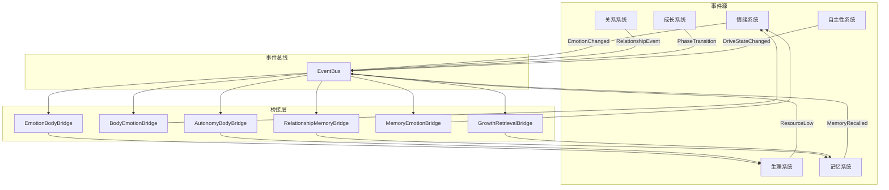

# 跨系统数据流协议

> **对应设计章节**: 架构优化
> **优先级**: P1
> **状态**: 待实现

---

## 一、设计目标

定义 AKIHO 各子系统之间的标准化接口协议，确保：
- 系统间数据流清晰、可追踪
- 状态变化能够触发跨系统联动
- 避免循环依赖和紧耦合

---

## 二、核心原则

### 2.1 数据流方向

```
事件发生 → 源系统发布 → 协议路由 → 目标系统订阅处理
```

### 2.2 事件驱动 vs 轮询

| 场景 | 推荐方式 |
|------|----------|
| 实时状态变化 | 事件驱动 (Event Bus) |
| 定期状态同步 | 轮询 (Polling) |
| 状态查询 | 直接调用 |

---

## 三、协议定义

### 3.1 系统间事件总线

```rust
/// 事件总线 - 系统间通信中枢
pub struct EventBus {
    subscribers: HashMap<EventType, Vec<EventHandler>>,
    event_queue: Vec<SystemEvent>,
}

#[derive(Debug, Clone)]
pub enum SystemEvent {
    // 情绪相关事件
    EmotionChanged { old: PADState, new: PADState },
    MoodShift { from: EmotionCategory, to: EmotionCategory },
    EmotionalPeak { emotion: EmotionCategory, intensity: f32 },

    // 生理相关事件
    EnergyDepleted { pool: PoolType },
    ResourceLow { pool: PoolType, level: f32 },
    FatigueAccumulated { delta: f32 },
    RestCompleted { quality: RestQuality },

    // 关系相关事件
    RelationshipUpgraded { user_id: String, from: Stage, to: Stage },
    TrustChanged { user_id: String, delta: f32 },
    ConflictOccurred { user_id: String, severity: f32 },

    // 成长相关事件
    PhaseTransition { from: GrowthPhase, to: GrowthPhase },
    TraitEvolved { trait_name: String, delta: f32 },
    MilestoneAchieved { milestone: String },

    // 记忆相关事件
    MemoryConsolidated { memory_id: String },
    MemoryForgotten { memory_id: String },
    SignificantMemory { memory_id: String },

    // 自主性相关事件
    DesireActivated { desire: DesireType, intensity: f32 },
    IntentFormed { intent: String },
    GoalAchieved { goal_id: String },
}

pub type EventHandler = Box<dyn Fn(&SystemEvent) + Send + Sync>;
```

### 3.2 事件订阅

```rust
impl EventBus {
    /// 订阅事件
    pub fn subscribe(&mut self, event_type: EventType, handler: EventHandler) {
        self.subscribers
            .entry(event_type)
            .or_default()
            .push(handler);
    }

    /// 发布事件
    pub fn publish(&mut self, event: SystemEvent) {
        let handlers = self.subscribers.get(&event.event_type());
        if let Some(handlers) = handlers {
            for handler in handlers {
                handler(&event);
            }
        }
        self.event_queue.push(event);
    }

    /// 批量处理事件
    pub fn flush(&mut self) {
        while let Some(event) = self.event_queue.pop() {
            self.publish_internal(&event);
        }
    }
}
```

---

## 四、跨系统桥接协议

### 4.1 情绪 → 生理桥接 (EmotionBodyBridge)

**触发条件**：
- 情绪强度 > 0.7 (高情绪状态)
- 情绪类型为 Anger/Fear/Anxiety (负向高唤醒)

**协议定义**：

```rust
pub struct EmotionBodyBridge {
    /// 高情绪状态时的资源消耗倍率
    pub emotional_overhead_multiplier: f32,
}

impl EmotionBodyBridge {
    /// 处理情绪变化对生理的影响
    pub fn on_emotion_changed(&self, old: &PADState, new: &PADState, pools: &mut ResourcePools) {
        // 计算情绪强度
        let old_intensity = self.calculate_intensity(old);
        let new_intensity = self.calculate_intensity(new);

        // 情绪显著增强
        if new_intensity - old_intensity > 0.3 {
            // 认知消耗增加（激烈思考）
            let cognitive_overhead = (new_intensity - old_intensity) * self.emotional_overhead_multiplier;
            pools.cognitive.consume(cognitive_overhead * 0.1);

            // 情绪池额外消耗（情绪处理）
            if new.arousal > 0.5 {
                pools.emotional.consume(new_intensity * 0.05);
            }
        }

        // 高唤醒状态（紧张/兴奋）
        if new.arousal > 0.6 && old.arousal <= 0.6 {
            // 社交资源恢复减慢
            pools.social.base_recovery_rate *= 0.8;
        } else if new.arousal <= 0.6 && old.arousal > 0.6 {
            // 恢复正常
            pools.social.base_recovery_rate /= 0.8;
        }
    }

    fn calculate_intensity(&self, state: &PADState) -> f32 {
        (state.pleasure.powi(2) + state.arousal.powi(2)).sqrt()
    }
}
```

**影响矩阵**：

| 情绪状态 | 认知池 | 社交池 | 情绪池 | 创造池 |
|----------|--------|--------|--------|--------|
| 高唤醒 (>0.6) | +20% 消耗 | -20% 恢复 | +10% 消耗 | 0 |
| 高愉悦 (>0.5) | 0 | +10% 恢复 | 0 | +15% 恢复 |
| 高负面 (<-0.3) | 0 | -10% 恢复 | +15% 消耗 | 0 |
| 情绪峰值 (>0.8) | +30% 消耗 | -30% 恢复 | +25% 消耗 | -20% 恢复 |

### 4.2 生理 → 情绪桥接 (BodyEmotionBridge)

**触发条件**：
- 任意资源池低于 0.2 (枯竭状态)
- 连续疲劳累积

**协议定义**：

```rust
pub struct BodyEmotionBridge {
    /// 疲劳对情绪的影响系数
    pub fatigue_emotion_factor: f32,
}

impl BodyEmotionBridge {
    /// 处理生理状态对情绪的影响
    pub fn on_body_state_changed(&self, pools: &ResourcePools, emotion: &mut PADState) {
        // 检查资源池状态
        let min_level = pools.overall_energy();

        // 能量严重不足
        if min_level < 0.2 {
            // 愉悦度下降
            emotion.pleasure -= (0.2 - min_level) * self.fatigue_emotion_factor;
            // 唤醒度下降
            emotion.arousal -= (0.2 - min_level) * self.fatigue_emotion_factor * 0.5;
            // 支配度下降（感到无力）
            emotion.dominance -= (0.2 - min_level) * self.fatigue_emotion_factor * 0.8;
        }
        // 能量轻度不足
        else if min_level < 0.4 {
            emotion.pleasure -= (0.4 - min_level) * self.fatigue_emotion_factor * 0.5;
        }

        // 限制范围
        emotion.clamp();
    }
}
```

### 4.3 关系 → 记忆桥接 (RelationshipMemoryBridge)

**触发条件**：
- 关系阶段升级/降级
- 信任度大幅变化 (>0.2)
- 重要关系事件 (Conflict, SharedSecret, Betrayal)

**协议定义**：

```rust
pub struct RelationshipMemoryBridge {
    /// 重要事件自动存储的阈值
    pub importance_threshold: f32,
}

impl RelationshipMemoryBridge {
    /// 处理关系事件，自动存储为情景记忆
    pub fn on_relationship_event(&self, event: &RelationshipEvent, memory: &mut MemoryStore) {
        let importance = self.calculate_importance(event);

        if importance >= self.importance_threshold {
            let memory_content = self.generate_memory_content(event);

            memory.store_episodic(EpisodicMemory::new(
                content: memory_content,
                event_type: EventType::Relationship(event.clone()),
                importance,
            ));
        }
    }

    fn calculate_importance(&self, event: &RelationshipEvent) -> f32 {
        match event {
            RelationshipEvent::StageChange { .. } => 0.9,
            RelationshipEvent::Conflict { severity } => *severity,
            RelationshipEvent::SharedSecret => 0.85,
            RelationshipEvent::Betrayal => 1.0,
            RelationshipEvent::Milestone { .. } => 0.8,
            _ => 0.5,
        }
    }

    fn generate_memory_content(&self, event: &RelationshipEvent) -> String {
        match event {
            RelationshipEvent::StageChange { from, to, user_id } => {
                format!("和 {} 的关系从 {} 发展到了 {}", user_id, from, to)
            }
            RelationshipEvent::Conflict { user_id, severity, .. } => {
                format!("和 {} 发生了冲突", user_id)
            }
            // ... 更多生成逻辑
        }
    }
}
```

### 4.4 成长 → 检索桥接 (GrowthRetrievalBridge)

**触发条件**：
- 成长阶段发生变化
- 人格特征发生显著变化

**协议定义**：

```rust
pub struct GrowthRetrievalBridge {
    /// 不同阶段检索权重配置
    pub phase_weight_configs: HashMap<GrowthPhase, RetrievalWeights>,
}

#[derive(Debug, Clone)]
pub struct RetrievalWeights {
    pub recency_weight: f32,      // 时效性权重
    pub importance_weight: f32,    // 重要性权重
    pub relationship_weight: f32, // 关系权重
    pub emotion_weight: f32,      // 情绪共鸣权重
}

impl GrowthRetrievalBridge {
    /// 获取当前阶段的检索权重
    pub fn get_weights(&self, phase: &GrowthPhase) -> RetrievalWeights {
        self.phase_weight_configs
            .get(phase)
            .cloned()
            .unwrap_or_else(|| RetrievalWeights::default())
    }

    /// 根据阶段调整检索参数
    pub fn adjust_retrieval_params(
        &self,
        phase: &GrowthPhase,
        base_params: &mut RetrievalParams,
    ) {
        let weights = self.get_weights(phase);

        base_params.recency_weight = weights.recency_weight;
        base_params.importance_weight = weights.importance_weight;
        base_params.emotional_resonance_enabled = weights.emotion_weight > 0.3;

        // 不同阶段的特殊处理
        match phase {
            GrowthPhase::Infant => {
                // 婴儿期：更依赖即时记忆
                base_params.max_age_hours = 24.0 * 7; // 一周
                base_params.recency_weight = 0.8;
            }
            GrowthPhase::Sage => {
                // 智慧期：重视长期记忆
                base_params.recency_weight = 0.3;
                base_params.importance_weight = 0.5;
                base_params.wisdom_boost = true;
            }
            _ => {}
        }
    }
}

impl Default for RetrievalWeights {
    fn default() -> Self {
        Self {
            recency_weight: 0.3,
            importance_weight: 0.3,
            relationship_weight: 0.2,
            emotion_weight: 0.2,
        }
    }
}
```

**阶段权重配置**：

| 阶段 | 时效性 | 重要性 | 关系 | 情绪共鸣 |
|------|--------|--------|------|----------|
| 婴儿期 | 0.8 | 0.1 | 0.1 | 0.0 |
| 幼儿期 | 0.6 | 0.2 | 0.1 | 0.1 |
| 儿童期 | 0.4 | 0.3 | 0.2 | 0.1 |
| 青春期 | 0.3 | 0.3 | 0.2 | 0.2 |
| 成熟期 | 0.3 | 0.4 | 0.2 | 0.1 |
| 智慧期 | 0.2 | 0.5 | 0.2 | 0.1 |

### 4.5 自主性 → 生理桥接 (AutonomyBodyBridge)

**触发条件**：
- 高驱动状态 (tension > 0.7)
- 意图形成并承诺执行

**协议定义**：

```rust
pub struct AutonomyBodyBridge {
    /// 高驱动状态的基础消耗倍率
    pub drive_overhead_multiplier: f32,
}

impl AutonomyBodyBridge {
    /// 处理自主性状态对生理的影响
    pub fn on_drive_state_changed(&self, drives: &DriveSystem, pools: &mut ResourcePools) {
        let total_tension = drives.total_tension();

        // 高驱动状态
        if total_tension > 0.7 {
            // 认知资源加速消耗（持续思考）
            let cognitive_overhead = (total_tension - 0.7) * self.drive_overhead_multiplier;
            pools.cognitive.consume(cognitive_overhead * 0.02);

            // 社交资源可能消耗或恢复
            let dominant = drives.dominant_drive();
            match dominant {
                Some(DriveType::Affiliation) => {
                    // 归属驱动：社交需求高
                    pools.social.consume(cognitive_overhead * 0.01);
                }
                Some(DriveType::Curiosity) => {
                    // 好奇驱动：认知消耗高
                    pools.cognitive.consume(cognitive_overhead * 0.03);
                }
                _ => {}
            }
        }
    }

    /// 处理意图执行对生理的影响
    pub fn on_intent_execution(&self, intent: &Intent, pools: &mut ResourcePools) {
        // 承诺执行的意图消耗更多
        if intent.commitment.strength > 0.7 {
            pools.cognitive.consume(0.05);
            pools.emotional.consume(0.03);
        }
    }
}
```

### 4.6 记忆 → 情绪桥接 (MemoryEmotionBridge)

**触发条件**：
- 记忆检索触发强烈情绪反应
- 回忆重要记忆

**协议定义**：

```rust
pub struct MemoryEmotionBridge {
    /// 情绪共鸣阈值
    pub resonance_threshold: f32,
}

impl MemoryEmotionBridge {
    /// 处理记忆唤起对情绪的影响
    pub fn on_memory_recalled(&self, memory: &EpisodicMemory, emotion: &mut PADState) {
        // 检查情绪标签
        for tag in &memory.emotional_tags {
            let impact = self.get_emotional_impact(tag);
            emotion.apply_impact(impact);
        }

        // 情绪共鸣效应
        if memory.emotional_intensity > self.resonance_threshold {
            // 重温情绪反应（但比原始体验弱）
            let resonance_decay = 0.3 + (memory.consolidation_level as f32 * 0.1);
            let intensity = memory.emotional_intensity * resonance_decay;
            emotion.apply_impact(PADImpact {
                pleasure: memory.emotional_valence * intensity * 0.5,
                arousal: memory.emotional_intensity * intensity * 0.3,
                dominance: 0.0,
            });
        }
    }

    fn get_emotional_impact(&self, tag: &str) -> PADImpact {
        match tag.to_lowercase().as_str() {
            "happy" | "joy" | "excited" => PADImpact {
                pleasure: 0.3, arousal: 0.2, dominance: 0.1
            },
            "sad" | "grief" => PADImpact {
                pleasure: -0.3, arousal: -0.1, dominance: -0.2
            },
            "angry" | "frustrated" => PADImpact {
                pleasure: -0.3, arousal: 0.3, dominance: 0.2
            },
            "fear" | "anxious" => PADImpact {
                pleasure: -0.2, arousal: 0.4, dominance: -0.3
            },
            _ => PADImpact::zero(),
        }
    }
}

#[derive(Debug, Clone)]
pub struct PADImpact {
    pub pleasure: f32,
    pub arousal: f32,
    pub dominance: f32,
}

impl PADImpact {
    pub fn zero() -> Self {
        Self { pleasure: 0.0, arousal: 0.0, dominance: 0.0 }
    }

    pub fn apply_to(&self, state: &mut PADState) {
        state.pleasure = (state.pleasure + self.pleasure).clamp(-1.0, 1.0);
        state.arousal = (state.arousal + self.arousal).clamp(-1.0, 1.0);
        state.dominance = (state.dominance + self.dominance).clamp(-1.0, 1.0);
    }
}
```

---

## 五、集成架构

### 5.1 桥接管理器

```rust
/// 跨系统桥接管理器
pub struct BridgeManager {
    pub emotion_body: EmotionBodyBridge,
    pub body_emotion: BodyEmotionBridge,
    pub relationship_memory: RelationshipMemoryBridge,
    pub growth_retrieval: GrowthRetrievalBridge,
    pub autonomy_body: AutonomyBodyBridge,
    pub memory_emotion: MemoryEmotionBridge,
}

impl BridgeManager {
    pub fn new() -> Self {
        Self {
            emotion_body: EmotionBodyBridge::new(),
            body_emotion: BodyEmotionBridge::new(),
            relationship_memory: RelationshipMemoryBridge::new(),
            growth_retrieval: GrowthRetrievalBridge::new(),
            autonomy_body: AutonomyBodyBridge::new(),
            memory_emotion: MemoryEmotionBridge::new(),
        }
    }

    /// 初始化事件订阅
    pub fn setup_subscriptions(&self, event_bus: &mut EventBus) {
        // 情绪变化 → 生理
        event_bus.subscribe(
            EventType::EmotionChanged,
            Box::new(|e| self.handle_emotion_changed(e)),
        );

        // 关系事件 → 记忆
        event_bus.subscribe(
            EventType::RelationshipUpgraded,
            Box::new(|e| self.handle_relationship_event(e)),
        );

        // 成长阶段变化 → 检索参数
        event_bus.subscribe(
            EventType::PhaseTransition,
            Box::new(|e| self.handle_phase_changed(e)),
        );

        // 记忆唤起 → 情绪
        event_bus.subscribe(
            EventType::SignificantMemory,
            Box::new(|e| self.handle_memory_recalled(e)),
        );
    }

    fn handle_emotion_changed(&self, event: &SystemEvent) {
        if let SystemEvent::EmotionChanged { old, new } = event {
            self.emotion_body.on_emotion_changed(old, new, &mut self.pools);
        }
    }

    // ... 其他处理器
}
```

### 5.2 完整的事件流图



---

## 六、配置

```json
{
  "cross_system_protocols": {
    "emotion_body_bridge": {
      "emotional_overhead_multiplier": 1.5,
      "high_arousal_threshold": 0.6,
      "low_energy_threshold": 0.2
    },
    "relationship_memory_bridge": {
      "importance_threshold": 0.7,
      "auto_store_stages": ["close_friend", "intimate"],
      "auto_store_events": ["conflict", "shared_secret", "betrayal"]
    },
    "growth_retrieval_bridge": {
      "phase_weights": {
        "infant": { "recency": 0.8, "importance": 0.1 },
        "child": { "recency": 0.4, "importance": 0.3 },
        "sage": { "recency": 0.2, "importance": 0.5 }
      }
    },
    "autonomy_body_bridge": {
      "drive_overhead_multiplier": 2.0,
      "high_tension_threshold": 0.7
    }
  }
}
```

---

## 七、性能考虑

### 7.1 事件批处理

为避免频繁的跨系统调用，使用事件批处理：

```rust
pub struct BatchedEventBus {
    inner: EventBus,
    pending_events: Vec<SystemEvent>,
    batch_size: usize,
    flush_interval: Duration,
}

impl BatchedEventBus {
    pub fn publish(&mut self, event: SystemEvent) {
        self.pending_events.push(event);

        if self.pending_events.len() >= self.batch_size {
            self.flush();
        }
    }

    pub fn flush(&mut self) {
        // 按事件类型分组，减少重复处理
        let grouped: HashMap<EventType, Vec<SystemEvent>> = self.pending_events
            .drain(..)
            .group_by(|e| e.event_type())
            .into_iter()
            .map(|(k, v)| (k, v.collect()))
            .collect();

        for (event_type, events) in grouped {
            // 只处理最新事件（对于状态变化事件）
            if let Some(latest) = events.last() {
                self.inner.publish(latest.clone());
            }
        }
    }
}
```

### 7.2 循环依赖检测

```rust
pub struct DependencyGraph {
    edges: HashMap<SystemId, Vec<SystemId>>,
}

impl DependencyGraph {
    pub fn add_edge(&mut self, from: SystemId, to: SystemId) {
        self.edges.entry(from).or_default().push(to);
    }

    /// 检测是否存在循环依赖
    pub fn has_cycle(&self) -> bool {
        let mut visited = HashSet::new();
        let mut rec_stack = HashSet::new();

        for node in self.edges.keys() {
            if self.detect_cycle(node, &mut visited, &mut rec_stack) {
                return true;
            }
        }
        false
    }

    fn detect_cycle(
        &self,
        node: &SystemId,
        visited: &mut HashSet<SystemId>,
        rec_stack: &mut HashSet<SystemId>,
    ) -> bool {
        if rec_stack.contains(node) {
            return true;  // 找到循环
        }
        if visited.contains(node) {
            return false;
        }

        visited.insert(node.clone());
        rec_stack.insert(node.clone());

        if let Some(neighbors) = self.edges.get(node) {
            for neighbor in neighbors {
                if self.detect_cycle(neighbor, visited, rec_stack) {
                    return true;
                }
            }
        }

        rec_stack.remove(node);
        false
    }
}
```

---

## 八、测试策略

### 8.1 桥接测试

```rust
#[cfg(test)]
mod bridge_tests {
    use super::*;

    #[test]
    fn test_emotion_body_bridge() {
        let bridge = EmotionBodyBridge::new();
        let mut pools = ResourcePools::new();

        let old = PADState { pleasure: 0.0, arousal: 0.0, dominance: 0.0 };
        let new = PADState { pleasure: 0.8, arousal: 0.7, dominance: 0.5 };

        bridge.on_emotion_changed(&old, &new, &mut pools);

        // 高情绪状态应该消耗认知资源
        assert!(pools.cognitive.current < 1.0);
    }

    #[test]
    fn test_no_circular_dependency() {
        let graph = DependencyGraph::new();
        graph.add_edge(SystemId::Emotion, SystemId::Body);
        graph.add_edge(SystemId::Body, SystemId::Emotion);

        // 应该有循环
        assert!(graph.has_cycle());
    }
}
```

---

*文档版本: 1.0.0*
*最后更新: 2026-05-06*
