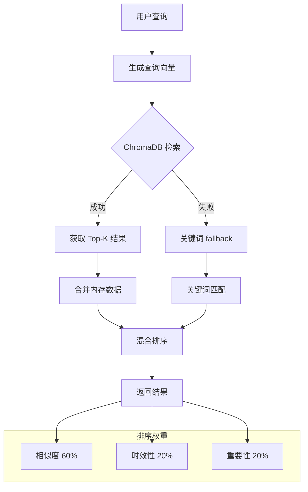

# 跨会话记忆系统详细设计

> **对应设计文档章节**: 十三（跨会话记忆管理）
> **优先级**: P0
>
> **架构说明**: 记忆的重要性/显著性采用统一评分。各子系统（情绪、自我模型、关系、成长）向记忆系统提供**分量**，由记忆系统计算唯一的 `significance_score`，而非各子系统独立评分。详见 [18_self_model.md](./18_self_model.md) 的自我相关性评估和本文档第六章。

---

## 一、设计目标

构建多层次记忆系统，支持：
- 情景记忆（Episodic Memory）
- 语义记忆（Semantic Memory）
- 工作记忆（Working Memory）
- 向量检索与语义搜索
- 记忆遗忘与巩固

---

## 二、记忆层次架构

```
┌─────────────────────────────────────────────────────────────┐
│                      记忆系统架构                            │
├─────────────────────────────────────────────────────────────┤
│                                                             │
│  ┌─────────────────────────────────────────────────────┐  │
│  │                    工作记忆                            │  │
│  │              (Working Memory)                        │  │
│  │           短期、当前上下文、快速访问                    │  │
│  └──────────────────────────┬────────────────────────────┘  │
│                             │ 遗忘/巩固                        │
│                             ▼                                  │
│  ┌─────────────────────────────────────────────────────┐  │
│  │                    情景记忆                            │  │
│  │              (Episodic Memory)                      │  │
│  │           时序事件、体验、时间戳                       │  │
│  └──────────────────────────┬────────────────────────────┘  │
│                             │ 抽象化                         │
│                             ▼                                  │
│  ┌─────────────────────────────────────────────────────┐  │
│  │                    语义记忆                            │  │
│  │              (Semantic Memory)                       │  │
│  │              概念、事实、关系                          │  │
│  └─────────────────────────────────────────────────────┘  │
│                                                             │
└─────────────────────────────────────────────────────────────┘
```

---

## 三、记忆类型

### 3.1 情景记忆

```rust
#[derive(Debug, Clone)]
pub struct EpisodicMemory {
    pub id: String,
    pub event_type: EventType,
    pub content: MemoryContent,
    pub emotional_tags: Vec<EmotionTag>,
    pub participants: Vec<Participant>,
    pub location: Option<String>,
    pub start_time: DateTime,
    pub end_time: Option<DateTime>,
    /// 统一显著性评分 (0.0 ~ 1.0) —— 各子系统贡献分量的加权综合
    pub significance_score: f32,
    /// 各子系统贡献明细（用于调试和权重调优）
    pub significance_components: SignificanceComponents,
    pub vividness: f32,
    pub retrieval_count: u32,
    pub last_retrieved: Option<DateTime>,
    pub consolidation_level: ConsolidationLevel,
}

/// 显著性分量 —— 各子系统对记忆重要性的独立评估
#[derive(Debug, Clone)]
pub struct SignificanceComponents {
    /// 情绪系统：情感强度贡献 (0.0 ~ 1.0)
    pub emotional_intensity: f32,
    /// SelfModel：自我相关性贡献 (0.0 ~ 1.0)
    pub self_relevance: f32,
    /// 关系系统：关系权重贡献 (0.0 ~ 1.0)
    pub relationship_weight: f32,
    /// 认知系统：新颖性贡献 (0.0 ~ 1.0)
    pub novelty: f32,
    /// 成长系统：成长关联贡献 (0.0 ~ 1.0)
    pub growth_connection: f32,
}

impl SignificanceComponents {
    /// 综合显著性分数（加权平均，权重可配置）
    pub fn composite(&self, weights: &SignificanceWeights) -> f32 {
        self.emotional_intensity * weights.emotional
            + self.self_relevance * weights.self_rel
            + self.relationship_weight * weights.relationship
            + self.novelty * weights.novelty
            + self.growth_connection * weights.growth
    }
}

#[derive(Debug, Clone)]
pub struct SignificanceWeights {
    pub emotional: f32,      // default: 0.25
    pub self_rel: f32,       // default: 0.25
    pub relationship: f32,   // default: 0.20
    pub novelty: f32,        // default: 0.15
    pub growth: f32,         // default: 0.15
}

impl Default for SignificanceWeights {
    fn default() -> Self {
        Self {
            emotional: 0.25,
            self_rel: 0.25,
            relationship: 0.20,
            novelty: 0.15,
            growth: 0.15,
        }
    }
}

#[derive(Debug, Clone)]
pub enum EventType {
    Conversation { topic: String },
    Activity { name: String },
    Observation { subject: String },
    Thought { content: String },
    Emotional { emotion: String },
    Goal { goal_id: String },
}

#[derive(Debug, Clone, Copy)]
pub enum ConsolidationLevel {
    New,           // 新记忆
    Labile,        // 不稳定
    Consolidating, // 巩固中
    Stable,        // 稳定
}
```

### 3.2 语义记忆

```rust
#[derive(Debug, Clone)]
pub struct SemanticMemory {
    pub id: String,
    pub concept: String,
    pub definition: String,
    pub category: ConceptCategory,
    pub properties: HashMap<String, Value>,
    pub related_concepts: Vec<String>,
    pub examples: Vec<String>,
    pub source_episodes: Vec<String>,  // 来源记忆ID
    pub confidence: f32,                // 置信度
    pub created_at: DateTime,
    pub last_updated: DateTime,
}

#[derive(Debug, Clone)]
pub enum ConceptCategory {
    Person,
    Place,
    Object,
    Event,
    Abstract,
    Rule,
    Preference,
}
```

### 3.3 工作记忆

```rust
#[derive(Debug, Clone)]
pub struct WorkingMemory {
    pub focus: Vec<MemoryRef>,      // 当前关注内容
    pub context: ContextSummary,
    pub active_goals: Vec<GoalRef>,
    pub recent_inputs: Vec<InputRef>,
    pub max_capacity: usize,          // 通常 7±2
}

impl WorkingMemory {
    pub fn push(&mut self, item: MemoryRef) {
        if self.focus.len() >= self.max_capacity {
            self.focus.remove(0);
        }
        self.focus.push(item);
    }

    pub fn clear(&mut self) {
        self.focus.clear();
        self.recent_inputs.clear();
    }
}
```

---

## 四、存储与检索

### 4.1 记忆存储

```rust
pub struct MemoryStore {
    episodic: Vec<EpisodicMemory>,
    semantic: Vec<SemanticMemory>,
    working: WorkingMemory,
    vector_index: VectorIndex,
    postgres: Pool<PostgresConnection>,
    redis: RedisPool,
}

impl MemoryStore {
    pub fn store_episodic(&mut self, memory: EpisodicMemory) -> Result<String> {
        let id = memory.id.clone();

        // 1. 存储到 PostgreSQL
        self.save_to_postgres(&memory)?;

        // 2. 创建向量嵌入
        let embedding = self.create_embedding(&memory.content)?;
        self.vector_index.insert(&id, &embedding)?;

        // 3. 更新 Redis 缓存
        self.cache_memory(&id, &memory)?;

        Ok(id)
    }

    pub fn store_semantic(&mut self, memory: SemanticMemory) -> Result<String> {
        let id = memory.id.clone();
        self.save_to_postgres(&memory)?;
        let embedding = self.create_embedding(&memory.definition)?;
        self.vector_index.insert(&id, &embedding)?;
        Ok(id)
    }

    fn create_embedding(&self, content: &MemoryContent) -> Result<Vec<f32>> {
        // 调用嵌入服务
        self.embedding_service.encode(content.to_text())
    }
}
```

### 4.2 记忆检索

```rust
pub struct MemoryRetriever {
    store: Arc<Mutex<MemoryStore>>,
    similarity_threshold: f32,
    recency_weight: f32,
    significance_weight: f32,
}

impl MemoryRetriever {
    pub fn retrieve(&self, query: &str, limit: usize) -> Result<Vec<MemoryResult>> {
        // 1. 向量检索
        let query_embedding = self.embedding_service.encode(query)?;
        let candidates = self.vector_index.search(&query_embedding, limit * 2)?;

        // 2. 混合排序
        let mut results: Vec<_> = candidates
            .into_iter()
            .map(|id| {
                let memory = self.store.lock().unwrap().get(&id);
                let score = self.calculate_relevance(&memory, query);
                MemoryResult { id, memory, score }
            })
            .collect();

        // 3. 排序和限制
        results.sort_by(|a, b| b.score.partial_cmp(&a.score).unwrap());
        results.truncate(limit);

        Ok(results)
    }

    fn calculate_relevance(&self, memory: &EpisodicMemory, query: &str) -> f32 {
        let semantic_score = memory.content.similarity(query);

        let recency_score = self.recency_factor(&memory.start_time);

        // 使用统一显著性评分（替代旧的 importance 字段）
        let significance_score = memory.significance_score;

        let retrieval_bonus = if memory.retrieval_count > 3 { 0.1 } else { 0.0 };

        semantic_score * 0.5
            + recency_score * self.recency_weight
            + significance_score * self.significance_weight
            + retrieval_bonus
    }

    fn recency_factor(&self, timestamp: &DateTime) -> f32 {
        let hours_old = (Utc::now() - timestamp).num_hours() as f32;
        (-hours_old / (24.0 * 7.0)).exp().max(0.1)
    }

    pub fn retrieve_related(&self, memory_id: &str, limit: usize) -> Result<Vec<MemoryResult>> {
        let source = self.store.lock().unwrap().get_episodic(memory_id)?;

        let emotional_tags = &source.emotional_tags;
        let participants = &source.participants;

        // 基于标签和参与者检索相关记忆
        let related = self.store.lock().unwrap()
            .find_by_tags_and_participants(emotional_tags, participants)?;

        Ok(related.into_iter().take(limit).map(|m| {
            MemoryResult {
                id: m.id.clone(),
                memory: Memory::Episodic(m),
                score: 0.8,
            }
        }).collect())
    }
}
```

---

## 五、遗忘与巩固

### 5.1 记忆巩固

```rust
pub struct MemoryConsolidation {
    consolidation_interval: Duration,
    rehearsal_threshold: u32,
}

impl MemoryConsolidation {
    pub fn process(&mut self, store: &mut MemoryStore) {
        for memory in &mut store.episodic {
            match memory.consolidation_level {
                ConsolidationLevel::New => {
                    // 24小时后进入不稳定期
                    if memory.start_time.elapsed() > Duration::hours(24) {
                        memory.consolidation_level = ConsolidationLevel::Labile;
                    }
                }
                ConsolidationLevel::Labile => {
                    // 强化时进入巩固期
                    if memory.retrieval_count >= self.rehearsal_threshold {
                        memory.consolidation_level = ConsolidationLevel::Consolidating;
                    }
                }
                ConsolidationLevel::Consolidating => {
                    // 巩固完成后变为稳定
                    memory.consolidation_level = ConsolidationLevel::Stable;
                }
                ConsolidationLevel::Stable => {
                    // 稳定记忆也可能被遗忘
                }
            }
        }
    }
}
```

### 5.2 自适应遗忘曲线

基础艾宾浩斯遗忘曲线过于简单，真实的人类记忆遗忘受多种因素影响。

```rust
/// 自适应遗忘曲线——考虑多种影响因素的遗忘模型
pub struct AdaptiveForgettingCurve {
    /// 基础衰减率
    base_decay_rate: f32,

    /// 检索强化因子
    retrieval_boost: f32,

    /// 情绪共鸣是否影响遗忘
    emotional_resonance_enabled: bool,

    /// 关联强度影响因子
    association_strength_factor: f32,

    /// 巩固级别衰减调整
    consolidation_decay_modifiers: HashMap<ConsolidationLevel, f32>,
}

impl Default for AdaptiveForgettingCurve {
    fn default() -> Self {
        let mut consolidation_decay_modifiers = HashMap::new();
        consolidation_decay_modifiers.insert(ConsolidationLevel::New, 1.0);      // 新记忆衰减最快
        consolidation_decay_modifiers.insert(ConsolidationLevel::Labile, 0.8);   // 不稳定记忆衰减较快
        consolidation_decay_modifiers.insert(ConsolidationLevel::Consolidating, 0.5);  // 巩固中衰减较慢
        consolidation_decay_modifiers.insert(ConsolidationLevel::Stable, 0.2);     // 稳定记忆衰减很慢

        Self {
            base_decay_rate: 0.1,
            retrieval_boost: 0.05,
            emotional_resonance_enabled: true,
            association_strength_factor: 0.3,
            consolidation_decay_modifiers,
        }
    }
}

impl AdaptiveForgettingCurve {
    /// 计算记忆强度
    pub fn calculate_strength(&self, memory: &Memory) -> f32 {
        // 1. 基础衰减（艾宾浩斯曲线）
        let age_hours = memory.age_hours();
        let base_decay = (-age_hours / (self.base_decay_rate * 24.0 * 7.0)).exp();  // 7天半衰期

        // 2. 检索强化
        let retrieval_boost = memory.retrieval_count as f32 * self.retrieval_boost;

        // 3. 情绪共鸣强化（情绪相关记忆更不容易遗忘）
        let emotional_boost = if self.emotional_resonance_enabled {
            memory.emotional_resonance_score * 0.3
        } else {
            0.0
        };

        // 4. 关联强度强化（与其他记忆关联多的更难遗忘）
        let association_boost = memory.association_strength * self.association_strength_factor;

        // 5. 巩固级别调整
        let consolidation_modifier = self
            .consolidation_decay_modifiers
            .get(&memory.consolidation_level)
            .copied()
            .unwrap_or(1.0);

        // 综合计算
        let strength = (base_decay + retrieval_boost + emotional_boost + association_boost)
            * consolidation_modifier;

        strength.clamp(0.0, 1.0)
    }

    /// 判断是否应该遗忘
    pub fn should_forget(&self, memory: &Memory) -> ForgetDecision {
        let strength = self.calculate_strength(memory);

        match memory.consolidation_level {
            ConsolidationLevel::New if strength < 0.05 => ForgetDecision::Forget,
            ConsolidationLevel::Labile if strength < 0.1 => ForgetDecision::MaybeForget,
            ConsolidationLevel::Stable if strength < 0.2 => ForgetDecision::Keep,
            _ if strength < 0.3 => ForgetDecision::MaybeForget,
            _ => ForgetDecision::Keep,
        }
    }
}

#[derive(Debug, Clone, Copy, PartialEq, Eq)]
pub enum ForgetDecision {
    /// 确定遗忘
    Forget,

    /// 可能遗忘（需要更多评估）
    MaybeForget,

    /// 保留
    Keep,
}

/// 情绪共鸣评估器
pub struct EmotionalResonanceEvaluator {
    /// 高情绪标签
    high_emotion_tags: HashSet<String>,
}

impl EmotionalResonanceEvaluator {
    pub fn new() -> Self {
        let mut tags = HashSet::new();
        tags.insert("first_time".to_string());
        tags.insert("milestone".to_string());
        tags.insert("breakthrough".to_string());
        tags.insert("turning_point".to_string());
        tags.insert("achievement".to_string());
        tags.insert("loss".to_string());
        tags.insert("betrayal".to_string());
        tags.insert("proud".to_string());
        tags.insert("shame".to_string());
        tags.insert("grief".to_string());

        Self { high_emotion_tags: tags }
    }

    /// 评估记忆的情绪共鸣分数
    pub fn evaluate(&self, memory: &Memory) -> f32 {
        let mut score = 0.0;

        // 情感标签检查
        for tag in &memory.emotional_tags {
            if self.high_emotion_tags.contains(tag) {
                score += 0.2;
            }
        }

        // 情感强度加成
        score += memory.emotional_intensity * 0.3;

        // 显著性加成（使用统一评分）
        score += memory.significance_score * 0.3;

        // 首次体验加成
        if memory.is_first_time {
            score += 0.3;
        }

        score.min(1.0)
    }
}

/// 遗忘调度器
pub struct ForgettingScheduler {
    curve: AdaptiveForgettingCurve,
    resonance_evaluator: EmotionalResonanceEvaluator,

    /// 上次检查时间
    last_check: std::time::Instant,

    /// 检查间隔
    check_interval: Duration,
}

impl ForgettingScheduler {
    pub fn new() -> Self {
        Self {
            curve: AdaptiveForgettingCurve::default(),
            resonance_evaluator: EmotionalResonanceEvaluator::new(),
            last_check: std::time::Instant::now(),
            check_interval: Duration::from_secs(3600),  // 每小时检查一次
        }
    }

    /// 检查是否需要执行遗忘
    pub fn check(&mut self, memories: &mut Vec<Memory>) -> Vec<MemoryToForget> {
        if self.last_check.elapsed() < self.check_interval {
            return Vec::new();
        }

        let mut to_forget = Vec::new();

        for memory in memories.iter() {
            // 更新情绪共鸣分数
            let resonance = self.resonance_evaluator.evaluate(memory);

            let decision = self.curve.should_forget(memory);

            if decision == ForgetDecision::Forget {
                to_forget.push(MemoryToForget {
                    memory_id: memory.id.clone(),
                    reason: ForgetReason::StrengthBelowThreshold(self.curve.calculate_strength(memory)),
                    reversible: memory.consolidation_level != ConsolidationLevel::Stable,
                });
            }
        }

        self.last_check = std::time::Instant::now();
        to_forget
    }
}

pub struct MemoryToForget {
    pub memory_id: MemoryId,
    pub reason: ForgetReason,
    pub reversible: bool,
}

pub enum ForgetReason {
    StrengthBelowThreshold(f32),
    UserRequest,
    ScheduledCleanup,
}
```

---

## 六、Rust 实现

### 6.1 核心结构

```rust:1:50:akiho-core/src/memory/mod.rs
mod episodic;
mod semantic;
mod retrieval;
mod embedding;

pub use episodic::EpisodicMemory;
pub use semantic::SemanticMemory;
pub use retrieval::MemoryRetriever;
pub use embedding::EmbeddingService;

use std::collections::HashMap;
use std::sync::{Arc, Mutex};

pub struct MemoryStore {
    episodic: HashMap<String, EpisodicMemory>,
    semantic: HashMap<String, SemanticMemory>,
    working: WorkingMemory,
}

impl MemoryStore {
    pub fn new() -> Self {
        Self {
            episodic: HashMap::new(),
            semantic: HashMap::new(),
            working: WorkingMemory::new(),
        }
    }

    pub fn store_episodic(&mut self, memory: EpisodicMemory) -> String {
        let id = memory.id.clone();
        self.episodic.insert(id.clone(), memory);
        id
    }

    pub fn store_semantic(&mut self, memory: SemanticMemory) -> String {
        let id = memory.id.clone();
        self.semantic.insert(id.clone(), memory);
        id
    }

    pub fn get(&self, id: &str) -> Option<&EpisodicMemory> {
        self.episodic.get(id)
    }

    pub fn get_semantic(&self, id: &str) -> Option<&SemanticMemory> {
        self.semantic.get(id)
    }

    pub fn all_episodic(&self) -> impl Iterator<Item = &EpisodicMemory> {
        self.episodic.values()
    }
}

pub struct WorkingMemory {
    pub focus: Vec<String>,
    pub context: String,
    pub max_capacity: usize,
}

impl WorkingMemory {
    pub fn new() -> Self {
        Self {
            focus: Vec::new(),
            context: String::new(),
            max_capacity: 7,
        }
    }
}
```

### 6.2 情景记忆

```rust:1:80:akiho-core/src/memory/episodic.rs
use serde::{Deserialize, Serialize};

#[derive(Debug, Clone, Serialize, Deserialize)]
pub struct EpisodicMemory {
    pub id: String,
    pub content: String,
    pub event_type: EventType,
    pub emotional_tags: Vec<String>,
    pub participants: Vec<String>,
    pub start_time: i64,  // Unix timestamp
    pub importance: f32,
    pub consolidation_level: u8,
    pub retrieval_count: u32,
}

#[derive(Debug, Clone, Serialize, Deserialize)]
pub enum EventType {
    Conversation,
    Activity,
    Observation,
    Thought,
    Emotional,
    Goal,
}

impl EpisodicMemory {
    pub fn new(content: String, event_type: EventType) -> Self {
        Self {
            id: uuid::Uuid::new_v4().to_string(),
            content,
            event_type,
            emotional_tags: Vec::new(),
            participants: Vec::new(),
            start_time: chrono::Utc::now().timestamp(),
            importance: 0.5,
            consolidation_level: 0,
            retrieval_count: 0,
        }
    }

    pub fn add_emotional_tag(&mut self, tag: String) {
        if !self.emotional_tags.contains(&tag) {
            self.emotional_tags.push(tag);
        }
    }

    pub fn add_participant(&mut self, participant: String) {
        if !self.participants.contains(&participant) {
            self.participants.push(participant);
        }
    }

    pub fn mark_retrieved(&mut self) {
        self.retrieval_count += 1;
    }
}
```

---

## 七、Python 绑定

```python
# engine/memory.py
from akiho_core import MemoryStore, MemoryRetriever
from typing import List, Optional

class PyMemoryManager:
    def __init__(self):
        self.store = MemoryStore()
        self.retriever = MemoryRetriever(self.store)

    def store_conversation(self, content: str, participants: List[str], emotion: str) -> str:
        memory = EpisodicMemory.new(
            content=content,
            event_type="conversation"
        )
        memory.add_participant(participants)
        memory.add_emotional_tag(emotion)
        return self.store.store_episodic(memory)

    def store_thought(self, content: str, emotion: str) -> str:
        memory = EpisodicMemory.new(
            content=content,
            event_type="thought"
        )
        memory.add_emotional_tag(emotion)
        return self.store.store_episodic(memory)

    def search(self, query: str, limit: int = 5) -> List[dict]:
        results = self.retriever.retrieve(query, limit)
        return [
            {
                "id": r.id,
                "content": r.memory.content,
                "score": r.score,
                "timestamp": r.memory.start_time,
            }
            for r in results
        ]

    def get_related(self, memory_id: str, limit: int = 3) -> List[dict]:
        results = self.retriever.retrieve_related(memory_id, limit)
        return [
            {
                "id": r.id,
                "content": r.memory.content,
                "score": r.score,
            }
            for r in results
        ]

    def get_recent(self, hours: int = 24, limit: int = 10) -> List[dict]:
        memories = self.store.all_episodic()
        cutoff = time.time() - hours * 3600
        recent = [m for m in memories if m.start_time >= cutoff]
        recent.sort(key=lambda m: m.start_time, reverse=True)
        return [
            {
                "id": m.id,
                "content": m.content,
                "timestamp": m.start_time,
            }
            for m in recent[:limit]
        ]
```

---

## 八、性能指标

| 指标 | 目标 | 说明 |
|------|------|------|
| 存储延迟 | < 50ms | 单条记忆 |
| 检索延迟 | < 100ms | 向量检索 |
| 记忆容量 | 100K+ | 支持长期 |
| 召回率 | > 85% | 相关检索 |

---

## 九、个人意义层 (PersonalMeaningLayer)

### 9.1 设计理念

**核心问题**：记忆只是存储信息，但没有与"我"建立关联

```
普通记忆存储：
  记忆内容：今天他夸我了
  → 存储：✓

个人意义层：
  记忆内容：今天他夸我了
  → 意义：这让我觉得自己是有价值的
  → 关联：我之前的付出没有白费
  → 影响：这个人的看法对我来说很重要
```

个人意义层让记忆成为"我的人生故事"的一部分。

### 9.2 意义结构定义

```rust
/// 个人意义层 - 为记忆赋予个人意义
pub struct PersonalMeaningLayer {
    /// 记忆 → 意义 的映射
    pub significance_map: HashMap<MemoryId, Significance>,

    /// 意义关联网络
    pub meaning_network: MeaningNetwork,

    /// 自我关联分析器
    pub self_relevance_analyzer: SelfRelevanceAnalyzer,
}

pub struct Significance {
    /// 对"我"的重要性（0.0 ~ 1.0）
    pub importance: f32,

    /// 情感强度
    pub emotional_charge: f32,

    /// 与自我认同的相关性
    pub self_relevance: f32,

    /// 与成长的关联程度
    pub growth_connection: f32,

    /// 意义描述（如"这让我明白..."）
    pub meaning_description: String,

    /// 关联的自我认知
    pub related_self_beliefs: Vec<String>,
}

pub struct MeaningNetwork {
    /// 意义关联边（如"这段经历让我明白..."）
    pub meaning_edges: Vec<MeaningEdge>,
}

pub struct MeaningEdge {
    pub memory_id: MemoryId,
    pub meaning_type: MeaningType,
    pub target_id: MemoryId,  // 关联到另一个记忆
    pub meaning_text: String,  // "这让我想起..."
}

pub enum MeaningType {
    Contrast,   // 对比：如"和以前不同了"
    Cause,      // 因果：如"这件事导致了..."
    Theme,      // 主题：如"这再次证明了..."
    Growth,     // 成长：如"我从中学会了..."
    Relationship, // 关系：如"这加深了我们..."
}
```

### 9.3 意义赋予算法

```rust
impl PersonalMeaningLayer {
    /// 为新记忆赋予个人意义
    pub fn assign_meaning(&mut self, memory: &Memory, context: &Context) -> Significance {
        // 1. 计算重要性
        let importance = self.calculate_importance(memory, context);

        // 2. 评估自我相关性
        let self_relevance = self.self_relevance_analyzer.analyze(memory, context);

        // 3. 检查与成长的关联
        let growth_connection = self.assess_growth_connection(memory, context);

        // 4. 生成意义描述
        let meaning_description = self.generate_meaning_description(memory, context);

        // 5. 更新意义网络
        self.update_meaning_network(memory, context);

        let significance = Significance {
            importance,
            emotional_charge: memory.emotional_intensity,
            self_relevance,
            growth_connection,
            meaning_description,
            related_self_beliefs: self.extract_self_beliefs(memory),
        };

        self.significance_map.insert(memory.id.clone(), significance.clone());
        significance
    }

    /// 计算重要性
    fn calculate_importance(&self, memory: &Memory, context: &Context) -> f32 {
        // 基础分数
        let base = memory.base_importance;

        // 情感权重
        let emotion_bonus = memory.emotional_intensity * 0.3;

        // 关系权重（与重要的人相关更重要）
        let relationship_bonus = context.get_relationship_importance(memory) * 0.2;

        // 情境权重
        let context_bonus = if memory.is_first_time {
            0.2
        } else {
            0.0
        };

        (base + emotion_bonus + relationship_bonus + context_bonus).min(1.0)
    }

    /// 生成意义描述
    fn generate_meaning_description(&self, memory: &Memory, context: &Context) -> String {
        let patterns = vec![
            "这让我明白{}",
            "{}对现在的我有意义",
            "通过这件事，我理解了{}",
            "这段经历教会了我{}",
        ];

        // 基于记忆内容生成具体描述
        let theme = self.extract_theme(memory);
        let lesson = self.extract_lesson(memory);

        format!(
            "这让我明白{}。{}",
            theme,
            lesson
        )
    }
}
```

---

## 十、体验标签系统 (ExperienceTagging)

### 10.1 设计理念

**核心问题**：记忆缺乏语义标签，难以系统理解"这是什么类型的经历"

```
普通记忆：
  "今天他第一次主动找我聊天"

体验标签：
  "第一次" + "关系进展" + "被主动关注" + "正面情感"
```

体验标签让记忆可以被分类、检索和理解。

### 10.2 体验标签类型

```rust
/// 体验标签系统
pub struct ExperienceTagging {
    /// 标签模板
    pub tag_templates: Vec<TagTemplate>,

    /// 自动标签规则
    pub auto_tag_rules: Vec<AutoTagRule>,
}

#[derive(Debug, Clone)]
pub enum ExperienceTag {
    /// "第一次"标签
    FirstTime {
        category: String,  // "第一次被夸奖"、"第一次主动联系"
    },

    /// 转折点标签
    TurningPoint {
        theme: String,  // "人际关系转折"、"自我认知转变"
    },

    /// 教训标签
    Lesson {
        lesson: String,  // "我学到了不要轻易相信"
    },

    /// 关系里程碑
    RelationshipMilestone {
        relationship_id: String,
        milestone_type: MilestoneType,
    },

    /// 自我发现
    SelfDiscovery {
        discovery: String,  // "发现自己其实很在意"
    },

    /// 情感突破
    EmotionalBreakthrough {
        emotion_type: String,
        description: String,
    },

    /// 遗憾时刻
    RegretMoment {
        what_could_have_been: String,
    },

    /// 骄傲时刻
    PrideMoment {
        achievement: String,
    },
}

pub enum MilestoneType {
    FirstInteraction,
    DeepConversation,
    ConflictResolution,
    MutualVulnerability,
    LongTimeNoContact,
    Reconnection,
}

pub struct TagTemplate {
    pub pattern: String,
    pub tag_type: ExperienceTag,
    pub priority: u8,
}
```

### 10.3 自动标签算法

```rust
impl ExperienceTagging {
    /// 自动为记忆打标签
    pub fn tag_memory(&self, memory: &Memory, context: &Context) -> Vec<ExperienceTag> {
        let mut tags = Vec::new();

        // 1. 检查"第一次"
        if let Some(first_time_tag) = self.check_first_time(memory, context) {
            tags.push(first_time_tag);
        }

        // 2. 检查转折点
        if self.is_significant_turning_point(memory, context) {
            tags.push(ExperienceTag::TurningPoint {
                theme: self.identify_turning_point_theme(memory, context),
            });
        }

        // 3. 检查教训
        if let Some(lesson) = self.extract_lesson_tag(memory) {
            tags.push(lesson);
        }

        // 4. 检查关系里程碑
        if let Some(milestone) = self.check_relationship_milestone(memory, context) {
            tags.push(milestone);
        }

        // 5. 检查自我发现
        if let Some(discovery) = self.check_self_discovery(memory) {
            tags.push(discovery);
        }

        // 按优先级排序
        tags.sort_by(|a, b| {
            self.get_priority(a).cmp(&self.get_priority(b))
        });

        tags
    }

    /// 检查"第一次"
    fn check_first_time(&self, memory: &Memory, context: &Context) -> Option<ExperienceTag> {
        // 检查是否在某个方面是第一次
        let category = self.detect_first_time_category(memory, context)?;

        Some(ExperienceTag::FirstTime { category })
    }

    /// 判断是否为重要转折点
    fn is_significant_turning_point(&self, memory: &Memory, context: &Context) -> bool {
        // 高情感强度
        if memory.emotional_intensity > 0.7 {
            return true;
        }

        // 重大行为变化
        if self.detected_behavior_change(memory, context) {
            return true;
        }

        // 自我认知变化
        if self.detected_self_identity_change(memory) {
            return true;
        }

        false
    }

    /// 提取教训
    fn extract_lesson_tag(&self, memory: &Memory) -> Option<ExperienceTag> {
        // 分析记忆内容，提取教训
        let lesson = self.analyze_for_lesson(memory)?;

        Some(ExperienceTag::Lesson { lesson })
    }

    /// 检查关系里程碑
    fn check_relationship_milestone(&self, memory: &Memory, context: &Context) -> Option<ExperienceTag> {
        let relationship_id = context.get_related_relationship(memory)?;

        let milestone_type = self.detect_milestone_type(memory, context)?;

        Some(ExperienceTag::RelationshipMilestone {
            relationship_id,
            milestone_type,
        })
    }

    /// 检查自我发现
    fn check_self_discovery(&self, memory: &Memory) -> Option<ExperienceTag> {
        let discovery = self.analyze_for_self_discovery(memory)?;

        Some(ExperienceTag::SelfDiscovery { discovery })
    }
}
```

---

## 十一、记忆检索增强

### 11.1 个人意义加权检索

```rust
/// 增强的记忆检索器
pub struct EnhancedMemoryRetriever {
    pub base_retriever: VectorRetriever,
    pub meaning_layer: PersonalMeaningLayer,
    pub experience_tagger: ExperienceTagging,
}

impl EnhancedMemoryRetriever {
    /// 检索记忆（考虑个人意义）
    pub fn retrieve_with_meaning(
        &self,
        query: &str,
        context: &Context,
        limit: usize
    ) -> Vec<MemoryWithSignificance> {
        // 1. 基础向量检索
        let candidates = self.base_retriever.search(query, limit * 2);

        // 2. 添加个人意义分数
        let with_significance: Vec<_> = candidates
            .into_iter()
            .map(|memory| {
                let significance = self.meaning_layer.get_significance(&memory.id);
                MemoryWithSignificance {
                    memory,
                    significance,
                }
            })
            .collect();

        // 3. 按综合分数排序
        let scored = with_significance
            .into_iter()
            .map(|mws| {
                let meaning_score = self.calculate_meaning_score(&mws.significance, context);
                let relevance_score = mws.memory.relevance_score;
                let final_score = relevance_score * 0.6 + meaning_score * 0.4;
                (mws, final_score)
            })
            .collect();

        // 4. 返回 Top-K
        scored
            .into_iter()
            .sort_by(|a, b| b.1.partial_cmp(&a.1).unwrap())
            .take(limit)
            .map(|(mws, _)| mws)
            .collect()
    }

    /// 计算意义分数（使用统一显著性评分）
    fn calculate_meaning_score(&self, significance: &Option<Significance>, context: &Context) -> f32 {
        match significance {
            Some(s) => {
                // 使用 composite_score() 作为统一入口
                s.composite_score()
            }
            None => 0.0,
        }
    }
}

pub struct MemoryWithSignificance {
    pub memory: Memory,
    pub significance: Option<Significance>,
}
```

---

## 十二、向量数据库集成 (Python 实现)

### 12.1 架构概览

```
┌─────────────────────────────────────────────────────────────┐
│                      记忆系统架构                            │
├─────────────────────────────────────────────────────────────┤
│                                                             │
│  ┌─────────────┐     ┌─────────────┐     ┌─────────────┐  │
│  │  PostgreSQL │     │   Redis     │     │  ChromaDB   │  │
│  │  (持久化)    │     │  (缓存)     │     │ (向量检索)  │  │
│  └──────┬──────┘     └──────┬──────┘     └──────┬──────┘  │
│         │                   │                    │         │
│         └───────────────────┼────────────────────┘         │
│                             ▼                              │
│                    ┌───────────────┐                      │
│                    │  MemoryManager │                      │
│                    │   (统一接口)   │                      │
│                    └───────┬───────┘                      │
│                            │                              │
│         ┌──────────────────┼──────────────────┐            │
│         ▼                  ▼                  ▼            │
│  ┌─────────────┐   ┌─────────────┐   ┌─────────────┐    │
│  │  情景记忆    │   │  语义记忆    │   │  工作记忆    │    │
│  └─────────────┘   └─────────────┘   └─────────────┘    │
│                                                             │
└─────────────────────────────────────────────────────────────┘
```

### 12.2 组件说明

| 组件 | 文件 | 职责 |
|------|------|------|
| `EmbeddingService` | `engine/embedding_service.py` | 文本向量化 |
| `VectorStore` | `engine/vector_store.py` | ChromaDB 封装 |
| `MemoryManager` | `engine/memory.py` | 统一接口 |

### 12.3 嵌入服务 (EmbeddingService)

```python
# engine/embedding_service.py
class EmbeddingService:
    """
    统一嵌入服务

    支持 providers:
    - dashscope (阿里云百炼, 默认)
    - siliconflow (BAAI/bge-m3)
    - openai (text-embedding-3-small)
    - deepseek
    """

    def __init__(
        self,
        provider: Optional[str] = None,
        model: Optional[str] = None,
        dimension: Optional[int] = None
    ):
        # 从 config.json 读取配置
        settings = get_settings()
        emb = settings.embedding

        self.provider = provider or emb.get("provider", "dashscope")
        self.api_key = emb.get("api_key", "")
        self.base_url = emb.get("base_url", "https://dashscope.aliyuncs.com/compatible-mode/v1")
        self.model = model or emb.get("model", "tongyi-embedding-vision-plus-2026-03-06")
        self.dimension = dimension or emb.get("dimension", 1024)

    async def encode(self, texts: List[str]) -> List[List[float]]:
        """将文本列表编码为向量列表"""

    async def encode_single(self, text: str) -> List[float]:
        """编码单个文本"""
```

**配置参数**：

```json
{
  "embedding": {
    "provider": "dashscope",
    "base_url": "https://dashscope.aliyuncs.com/compatible-mode/v1",
    "model": "tongyi-embedding-vision-plus-2026-03-06",
    "api_key": "your-api-key",
    "dimension": 1024
  }
}
```

### 12.4 向量存储 (VectorStore)

```python
# engine/vector_store.py
class VectorStore:
    """
    ChromaDB 向量存储

    功能:
    - 持久化存储向量
    - 语义相似度搜索
    - 按元数据过滤
    """

    def __init__(
        self,
        persist_directory: str = "./data/chroma",
        collection_name: str = "memories"
    ):
        self.client = chromadb.PersistentClient(path=persist_directory)
        self.collection = self.client.get_or_create_collection(
            name=collection_name,
            metadata={
                "hnsw:space": "cosine",  # 余弦距离
                "hnsw:construction_ef": 100,
                "hnsw:search_ef": 100
            }
        )

    def add_memory(
        self,
        memory_id: str,
        content: str,
        embedding: List[float],
        metadata: Optional[Dict[str, Any]] = None
    ) -> None:
        """添加记忆到向量库"""

    def search(
        self,
        query_embedding: List[float],
        n_results: int = 5,
        filter_dict: Optional[Dict[str, Any]] = None
    ) -> List[Dict[str, Any]]:
        """向量相似度搜索"""

    def get(self, memory_id: str) -> Optional[Dict[str, Any]]:
        """获取单个记忆"""

    def delete(self, memory_id: str) -> None:
        """删除记忆"""
```

**向量数据结构**：

```python
{
    "id": "uuid",
    "content": "记忆内容文本",
    "embedding": [0.1, 0.2, ...],  # 1024维向量
    "metadata": {
        "memory_type": "episodic",
        "event_type": "conversation",
        "timestamp": "2026-05-06T12:00:00",
        "participants": "user_001,user_002",
        "emotional_tags": "happy,excited",
        "importance": "0.8"
    }
}
```

### 12.5 记忆管理器 (MemoryManager)

```python
# engine/memory.py
class MemoryManager:
    """
    记忆管理器 - 支持向量检索

    功能:
    - 记忆存储（同步内存 + 异步向量库）
    - 语义搜索（向量检索）
    - 关键词搜索（fallback）
    - 工作记忆管理
    - 记忆巩固与遗忘
    """

    def __init__(
        self,
        vector_store: Optional[VectorStore] = None,
        embedding_service: Optional[EmbeddingService] = None
    ):
        self.vector_store = vector_store or get_vector_store()
        self.embedding_service = embedding_service or get_embedding_service()
        self.memories: Dict[str, Memory] = {}
        self.working_memory: List[str] = []

    async def store_conversation(
        self,
        content: str,
        user_id: str,
        emotion: Optional[str] = None
    ) -> str:
        """存储对话记忆（自动生成向量）"""

    async def store_semantic(
        self,
        concept: str,
        definition: str,
        category: str
    ) -> str:
        """存储语义记忆"""

    async def search(
        self,
        query: str,
        limit: int = 5,
        memory_type: Optional[str] = None
    ) -> List[Dict[str, Any]]:
        """语义搜索记忆（向量检索）"""

    def get_recent(
        self,
        hours: int = 24,
        limit: int = 10
    ) -> List[Dict[str, Any]]:
        """获取最近的记忆"""

    def get_related(
        self,
        memory_id: str,
        limit: int = 3
    ) -> List[Dict[str, Any]]:
        """获取相关记忆（基于标签和参与者）"""

    async def consolidate(self) -> None:
        """记忆巩固"""

    async def forget(self, dry_run: bool = False) -> List[str]:
        """遗忘不重要的记忆"""
```

### 12.6 检索流程



### 12.7 使用示例

```python
from engine.memory import MemoryManager, get_memory_manager

# 初始化
manager = get_memory_manager()

# 存储记忆（自动生成向量）
memory_id = await manager.store_conversation(
    content="今天主人夸我了，好开心",
    user_id="owner_001",
    emotion="happy"
)

# 语义搜索（基于向量相似度）
results = await manager.search("开心的事")
# 返回:
# [
#     {
#         "id": "...",
#         "content": "今天主人夸我了，好开心",
#         "similarity": 0.92,
#         "importance": 0.7
#     }
# ]

# 获取最近记忆
recent = await manager.get_recent(hours=24, limit=10)

# 获取相关记忆
related = manager.get_related(memory_id)

# 获取统计
stats = manager.get_stats()
# {'total': 10, 'by_type': {...}, 'vector_count': 10}
```

### 12.8 依赖

```txt
# requirements.txt
chromadb>=0.5.0
httpx>=0.25.0
```

### 12.9 存储结构

```
data/
└── chroma/           # ChromaDB 持久化目录
    └── memories/
        ├── data.db   # 向量数据
        └── index.bin # 索引文件
```

---

## 十三、待实现功能

### 13.1 个人意义层 (PersonalMeaningLayer)

详见第九章设计，待实现 `engine/meaning_layer.py`

### 13.2 体验标签系统 (ExperienceTagging)

详见第十章设计，待实现 `engine/experience_tagger.py`

### 13.3 PostgreSQL 持久化

将记忆数据从内存持久化到 PostgreSQL，支持跨进程共享

### 13.4 Redis 缓存

热数据缓存到 Redis，提升访问速度
